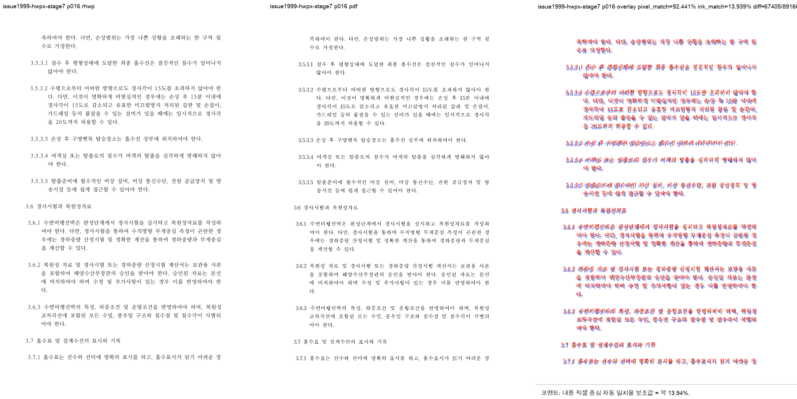

# PR #2005 리뷰 - #1999 RowBreak 거대 셀 쪽수 정합 보정

## PR 메타

| 항목 | 값 |
|---|---|
| PR | #2005 |
| 제목 | task 1999: RowBreak 거대 셀 쪽수 정합 보정 |
| 작성자 | jangster77 |
| base | devel |
| head | task_m100_1999_issue1949_page_parity |
| 관련 이슈 | #1999 |
| 문서 작성 시점 참고값 | mergeable=MERGEABLE, mergeStateStatus=BLOCKED |
| 코드 검증 기준 SHA | `5f896e00f` |

`mergeable`, `mergeStateStatus`, `head SHA`는 문서 작성 시점 참고값이다. 옵션 1 문서/asset/오늘할일 커밋 후
PR head가 다시 갱신되므로, 최종 merge 조건은 최신 PR head 기준 GitHub Actions 통과와 작업지시자 승인이다.

## 관련 이슈

#1999는 #1949 성능 개선 이후 남은 한컴 기준 PDF 115쪽과 rhwp 112쪽의 쪽수/시각 정합 차이를 추적하는
후속 이슈다.

기준 자료:

- HWPX 샘플: `samples/issue1949_giant_cell_nested_tables_perf.hwpx`
- HWP 저장본 샘플: `samples/issue1949_giant_cell_nested_tables_perf.hwp`
- 기준 PDF: `pdf/issue1949_giant_cell_nested_tables_perf-2024.pdf`

## 변경 범위

- `src/renderer/layout/table_layout.rs`
  - RowBreak 표의 큰 셀 cut/continuation 단위를 보정했다.
  - non-inline flow fragment와 `TopAndBottom` flow를 구분하고, 뒤쪽 `TopAndBottom` flow 앞에서 선행 fragment가
    완전히 사라지지 않도록 되감기 조건을 추가했다.
  - hard break 완화는 HWPX 여부가 아니라 문서 속성과 레이아웃 단위 상태에 근거하도록 정리했다.
- `src/renderer/layout/table_partial.rs`
  - partial table continuation 높이 및 cut 계산과 연동되는 상태를 보정했다.
- `src/renderer/height_measurer.rs`
  - RowBreak 거대 셀 측정 경로와 실제 배치 경로가 같은 판단을 쓰도록 정리했다.
- `tests/issue_1949_giant_cell_render_perf.rs`
  - HWPX와 HWP 저장본 모두 기준 PDF 115쪽과 같은 쪽수로 렌더되는지 회귀 가드를 추가했다.
- `samples/issue1949_giant_cell_nested_tables_perf.hwp`
  - 한컴 저장 HWP 경로 회귀 가드용 샘플을 추가했다.

## 보정 근거

특정 샘플명, 페이지 번호, PR/issue 번호, 임의 계수로 결과를 맞춘 분기는 두지 않았다. 보정 근거는 다음 문서
속성과 렌더러 내부의 일반화된 레이아웃 상태다.

- 표 `page_break = RowBreak`
- 표 `common.treat_as_char = false`
- 문단/표 안 non-inline control의 `TextWrap`
- 빈 anchor 문단의 `TopAndBottom` control
- 셀 단위의 fragment/empty spacer/top-and-bottom flow 구분
- 저장 `LineSeg` hard break와 continuation cut 위치

## 렌더 영향 및 시각 검증 판정

renderer/layout 쪽수·표 split·그림 flow를 직접 바꾸므로 visual sweep 대상이다.

수행한 visual sweep:

```bash
python3 scripts/task1274_visual_sweep.py --key issue1999-p14-16-stage7 \
  --file-target issue1999-hwp-stage7 samples/issue1949_giant_cell_nested_tables_perf.hwp pdf/issue1949_giant_cell_nested_tables_perf-2024.pdf \
  --file-target issue1999-hwpx-stage7 samples/issue1949_giant_cell_nested_tables_perf.hwpx pdf/issue1949_giant_cell_nested_tables_perf-2024.pdf \
  --pages 14-16 \
  --out output/task1999_issue1999_p14_16_stage7 \
  --rhwp-bin target/debug/rhwp
```

결과:

- HWP: SVG/PDF/render-tree 115/115/115쪽, 14~16쪽 `flagged=0/3`
- HWPX: SVG/PDF/render-tree 115/115/115쪽, 14~16쪽 `flagged=0/3`
- 평균 pixel match: `92.3305%`
- 평균 내용 픽셀 중심 자동 일치율 보조값: `13.64366%`
- 임시 summary: `output/task1999_issue1999_p14_16_stage7/summary.json`
- 대표 review PNG 임시 경로: `output/task1999_issue1999_p14_16_stage7/issue1999-hwpx-stage7/review/review_016.png`
- 대표 asset 경로: `mydocs/pr/assets/pr_2005_issue1999_p16_hwpx_review.png`

대표 asset:



## 로컬 검증

최신 `upstream/devel` rebase 후 수행했다.

- `cargo fmt --check`: 통과
- `git diff --check`: 통과
- `env CARGO_INCREMENTAL=0 cargo test --test issue_1949_giant_cell_render_perf`: 통과
- `env CARGO_INCREMENTAL=0 cargo test --test issue_rowbreak_chart_overlap`: 20 passed
- `env CARGO_INCREMENTAL=0 cargo test --profile release-test --tests`: 통과
  - `tests/svg_snapshot.rs`도 포함되어 8 passed
- `env CARGO_INCREMENTAL=0 cargo clippy --all-targets -- -D warnings`: 통과

## 리스크

- RowBreak 큰 셀, non-inline control, `TopAndBottom` flow는 기존 레이아웃 회귀 가능성이 큰 영역이다.
- 이를 줄이기 위해 #1999 샘플 자체, HWP 저장본, `issue_rowbreak_chart_overlap`, 기존 쪽수/flow 회귀 테스트를
  함께 확인했다.

## 최종 권고

PR #2005는 merge 후보로 판단한다.

merge 전 조건:

- 최신 PR head 기준 GitHub Actions 통과
- 작업지시자 승인

