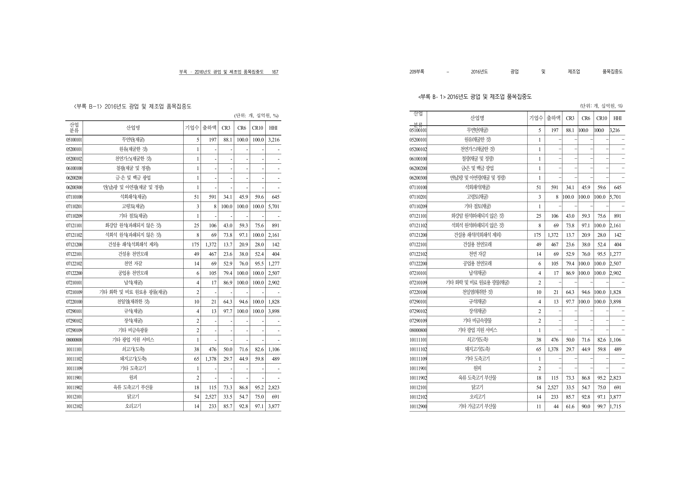

# PR #2210 리뷰 - RowBreak 대형 표 밀도 개선

## PR 메타

| 항목 | 내용 |
|---|---|
| PR | [#2210](https://github.com/edwardkim/rhwp/pull/2210) |
| 제목 | `Task #2070 v2: RowBreak 대형 표 밀도 — 행미 공백 유령 줄 + aim 패딩 0 존중 (시장구조조사 606→357쪽)` |
| 작성자 | `planet6897` |
| base | `devel` |
| 관련 이슈 | [#2070](https://github.com/edwardkim/rhwp/issues/2070) |
| 규모 | 문서 작성 시점 참고값: 10 files, +190/-976 (HWP/PDF 검증 자산 포함) |
| 최종 head | `fcd14c0f9e0821e3ec22c3f1efdc81bc33d2a1b8` |
| merge 결과 | `a409e93d1fddc88eb084336dbff0f14ea1bea2c2`로 merge 완료 |
| 이슈 결과 | [#2070](https://github.com/edwardkim/rhwp/issues/2070)은 잔여 CellBreak -3쪽과 RowBreak +42쪽 추적을 위해 open 유지 |

PR 검토 중 작성자가 최신 `devel`을 병합했다. 최종 head는 원 코드 커밋 `65cdd3c`와
`devel` 병합 커밋 `fcd14c0`으로 구성되며, 최종 merge 전 최신 head 기준 GitHub Actions를 다시 확인했다.

## 변경 범위

- `src/renderer/composer.rs`
  - 셀 재조합 폭 판정에서 행미 ASCII 공백을 제외하고, 공백만 남은 분할 조각은 직전 줄에 흡수한다.
- `src/model/table.rs`
  - `apply_inner_margin=true`인 축에서 0을 셀 고유 padding으로 사용하고 음수만 결측 센티널로 표 padding에 폴백한다.
- `tests/issue_2070_rowbreak_density.rs`
  - 시장구조조사 357쪽 및 CellBreak 원문 타깃 159쪽의 잠정 페이지 수를 고정한다.
- `samples/task2070/`과 `pdf/task2070/`
  - 시장구조조사 HWP 원본과 Hancom 2022 기준 PDF 315쪽을 보존한다.

## Findings

blocking finding은 없다.

### P2. aim=true padding 0 계약의 오래된 소스 주석

구현은 `aim=true && padding=0`을 셀 고유값으로 존중하도록 바뀌었지만, 아래 주석은 여전히
"0은 표 기본 padding으로 폴백"한다고 설명한다.

- `src/model/table.rs`의 `Cell::use_cell_padding_axis` API 주석
- `src/renderer/height_measurer.rs`의 row-span 1 및 병합 셀 설명 주석

코드와 [#493](https://github.com/edwardkim/rhwp/issues/493) 회귀 테스트는 현재 계약에 맞게 동작하므로 merge
blocker로 보지 않았다. 다음 관련 소스 수정에서 세 주석을 "0은 존중, 음수만 결측 센티널"로 정정해야 한다.

## 검증 결과

최종 update branch 트리에서 다음을 수행했다.

- `cargo fmt --all -- --check` 통과
- `CARGO_INCREMENTAL=0 cargo test --profile release-test --test issue_2070_rowbreak_density -- --nocapture`
  - 2 passed: 시장구조조사 357쪽, CellBreak 원문 타깃 159쪽
- `CARGO_INCREMENTAL=0 cargo test --profile release-test --test issue_1785_cell_padding_rule_consistency -- --nocapture`
  - 2 passed: aim=true padding 0 및 음수 센티널 규칙, micro-grid roundtrip geometry
- `CARGO_INCREMENTAL=0 cargo test --profile release-test --test issue_493_cell_attrs -- --nocapture`
  - 18 passed: 기존 0 padding/세로 resize 계약 무회귀
- `CARGO_INCREMENTAL=0 cargo test --profile release-test --test svg_snapshot table_text_page_0 -- --nocapture`
  - 1 passed
- `wasm-pack build --target web --out-dir pkg` 통과
- GitHub Actions, 최종 `fcd14c0` 기준
  - Build default-feature tests, Native Skia tests, Canvas visual diff, CodeQL Rust/JS/Python 모두 통과
  - WASM Build는 CI path 조건으로 skipped였으며, 로컬 WASM build로 별도 확인했다.

전체 `cargo test --profile release-test --tests` 및 `cargo clippy --all-targets -- -D warnings`는 이 review에서
수행하지 않았다. 변경 범위에 직접 연결된 pagination, padding, #493, SVG golden과 WASM build를 선택 검증했다.

## 기준 PDF 및 시각 검증

기준 PDF `pdf/task2070/1130000-201900011_D0150004-1-002_2017년기준 시장구조조사-2022.pdf`는
Hancom 2022 PDF(`Hancom PDF 1.3.0.550`)이며 A4 315쪽임을 `pdfinfo`로 확인했다. rhwp는 357쪽으로,
이번 수정은 `606 -> 357`의 부분 개선이며 기준 대비 **+42쪽 잔여**가 있다.

전체 쪽수가 달라 자동 visual sweep의 같은 페이지 번호 비교는 다른 내용끼리 비교하게 되므로 사용하지 않았다.
대신 표 코드 `05100101`을 앵커로 PDF 178쪽과 rhwp 220쪽을 대응시켜 직접 판정했다.

- 좌측: Hancom 2022 PDF 178쪽, 우측: rhwp 220쪽
- 표 제목, 8개 열, `05100101` 이후 산업 분류·수치 흐름이 대응한다.
- 수정 전 원인이던 행미 공백 단독 줄은 대표 페이지에서 보이지 않는다.
- 이 asset은 page-number fidelity 완료 판정이 아니라, 이번 공백 hanging 및 padding 0 규칙이 대표 거대 표에서
  실제 표 구조를 유지한 채 적용됐음을 보이는 증적이다.

## 최종 권고 및 후속 처리

PR의 목표인 RowBreak 거대 표의 공백 유령 줄 및 aim=true padding 0 처리 개선은 검증됐다. 잔여 `+42쪽`과
CellBreak `-3쪽`은 [#2070](https://github.com/edwardkim/rhwp/issues/2070)의 후속 pagination fidelity 축으로
유지한다. 비차단 P2 주석 정합성은 다음 관련 소스 변경에서 보완한다.

최종 head의 GitHub Actions 통과 후 `a409e93d1fddc88eb084336dbff0f14ea1bea2c2`로 merge했다. 이 문서와
시각 비교 asset은 옵션 2 docs-only fast-pass PR로 보존한다. 해당 후속 PR merge 후 원 PR과 [#2070](https://github.com/edwardkim/rhwp/issues/2070)에
asset 링크 및 잔여 추적 상태를 남긴다.
