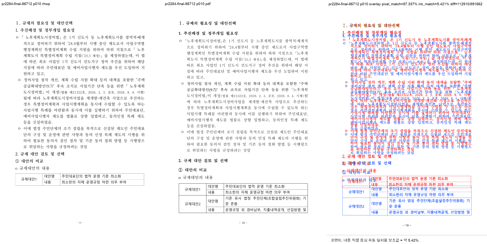
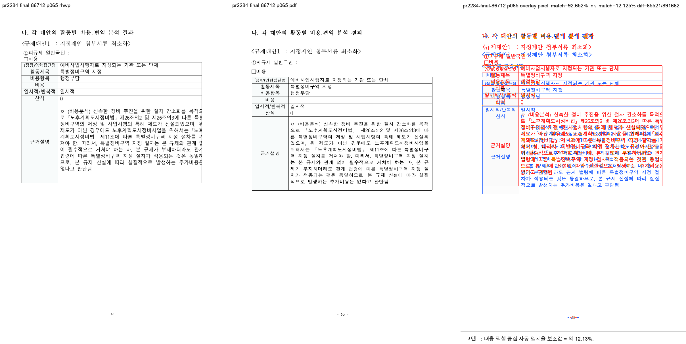

# PR #2284 검토 - #2279 footer 계측과 layout 정합 변경

- 최초 검토: 2026-07-15
- 최종 재검토 및 병합: 2026-07-16
- 작성자: planet6897
- 대상: [PR #2284](https://github.com/edwardkim/rhwp/pull/2284), [Issue #2279](https://github.com/edwardkim/rhwp/issues/2279)
- 최종 head: `17d7a6c06437ffcaf7bb200b0e829b1224471a4c`
- merge commit: `f4655e50f27f8fdfe4dd5e8561192d990fdd1cfd`
- 규모: 42 files, +1237/-80 (HWPX footer fixture 25개, renderer/typeset 5개 파일, 회귀 oracle 및 진단 도구)
- 리뷰어: `jangster77` 지정 및 최종 승인

## 변경 범위와 재검토

초기 검토에서는 실제 renderer/typeset 동작 변경에 직접 회귀 oracle이 없고, 도구의 portable 실행과 gate 의미도 불명확해 재작업을 요청했다.

기여자는 후속 head에서 다음을 보완했다.

1. `tests/issue_2279_layout_oracles.rs`에 1x1 중첩 셀 높이, 본문 재래핑 꼬리, 줄별 pitch, RowBreak 이월의 render tree oracle 4개를 추가했다.
2. PR 본문을 실제 기능 변경 5건과 보류 축에 맞춰 갱신했다.
3. `code_slack_probe.py`와 `t172_gate.py`의 실행 파일 기본 경로를 플랫폼별로 처리하고, `t172_gate.py`가 불일치 시 실패하도록 변경했다.
4. 최종 footer 보정에서 TopAndBottom 개체의 저장 관례를 `lead = host_first - prev_last_end`로 판별해 host 줄박스의 별도 소비 여부를 정하고, footer margin을 62px에서 50px으로 재보정했다.

최종 footer 보정의 대표 fixture도 직접 비교했다.

- `36395825_gyeoljae.hwpx`: 직전 head 1쪽에서 최종 head 2쪽으로 전환됐다.
- `36376848_gyeoljae.hwpx`: 1쪽을 유지했다.

두 fixture를 직접 고정하는 footer oracle은 후속 보완 요청으로 남겼다. 이는 최종 변경의 실제 동작과 전체 회귀가 확인된 뒤의 검증 강화 항목이며, 이번 병합 보류 사유로 판단하지 않았다.

[Issue #2279](https://github.com/edwardkim/rhwp/issues/2279)는 footer/table/font fidelity의 umbrella 추적 이슈이므로 open 상태를 유지한다. 이 PR에는 closing keyword가 없다.

## 검증

- focused regression: `CARGO_INCREMENTAL=0 CARGO_TARGET_DIR=/private/tmp/rhwp-pr2284-target cargo test --test issue_2279_layout_oracles` - 4 passed
- 전체 회귀: `CARGO_INCREMENTAL=0 CARGO_TARGET_DIR=/private/tmp/rhwp-pr2284-target cargo test --profile release-test --tests` - passed
- build: `CARGO_INCREMENTAL=0 CARGO_TARGET_DIR=/private/tmp/rhwp-pr2284-target cargo build` - passed
- knife-edge gate: `python3 tools/task2279/t172_gate.py --exe /private/tmp/rhwp-pr2284-target/debug/rhwp` - 65쪽, r27 1373.2, passed
- 정적 검사: `cargo fmt --check`, `CARGO_INCREMENTAL=0 CARGO_TARGET_DIR=/private/tmp/rhwp-pr2284-target cargo clippy --all-targets -- -D warnings` - passed
- WASM: `wasm-pack build --target web --out-dir pkg` - passed
- GitHub Actions: CI preflight, Build & Test, Build default-feature tests, Native Skia tests, CodeQL, Canvas visual diff 성공. WASM Build와 Frontend package gates는 workflow 조건상 skipped.

## Visual Sweep

최종 merge commit과 동일한 `devel`에서 `samples/86712_regulatory_analysis.hwp`를 `pdf/issue1921/86712_regulatory_analysis-2024.pdf`와 비교했다.

- 명령: `python3 scripts/task1274_visual_sweep.py --key pr2284-final-86712 --hwp samples/86712_regulatory_analysis.hwp --pdf pdf/issue1921/86712_regulatory_analysis-2024.pdf --pages 10,65 --rhwp-bin /private/tmp/rhwp-pr2284-record-target/debug/rhwp --out /private/tmp/rhwp-pr2284-final-visual`
- 페이지 수: 기준 PDF 65쪽 / rhwp SVG 및 render tree 65쪽
- 선택 페이지 structural flag: 0/2
- p10: pixel match `87.33713%`, 내용 픽셀 중심 보조값 `5.42125%`
- p65: pixel match `92.65181%`, 내용 픽셀 중심 보조값 `12.12548%`

현재 macOS 검토 환경은 Hancom 계열 글꼴이 없어 fallback으로 표시된다. 따라서 픽셀 수치는 font fidelity의 합격/불합격 근거로 쓰지 않고, PR이 겨냥한 p10 표 구조와 p65 페이지 구조에 차단 후보가 없는지 확인하는 보조 자료로 사용했다.

최종 증적:

## 추가 보완 요청

p10 overlay는 표가 p10에 남는 구조적 목적은 충족했지만, 기준 PDF와 rhwp 본문·표의 글줄 위치가 여전히 넓게 벌어지는 모습을 보인다. 현재 macOS의 Hancom 글꼴 부재가 이 차이에 영향을 주므로 이 이미지만으로 원인을 코드로 단정하지 않는다.

다만 이 증적은 [Issue #2279](https://github.com/edwardkim/rhwp/issues/2279)의 다음 후속 검증에 사용한다.

1. Hancom 계열 글꼴이 적용된 환경에서 p10 첫 본문 시작 위치와 표 행 위치를 기준 PDF에 다시 대조한다.
2. 글꼴 fidelity를 배제하고도 시작 위치 차이가 남으면, 해당 수직 위치 오차를 별도 renderer/layout 축으로 고정하고 수정한다.
3. footer 경계 fixture `36395825=2쪽`, `36376848=1쪽`을 직접 assert하는 regression oracle을 추가한다.

위 항목은 이번 PR의 merge blocker가 아니라 시각 fidelity와 장기 회귀 방지를 위한 후속 보완이다.

## 최종 판단

**Approved and merged.** [PR #2284](https://github.com/edwardkim/rhwp/pull/2284)는 `f4655e50f27f8fdfe4dd5e8561192d990fdd1cfd`로 병합됐다.

직접 footer oracle 추가와 저자 환경에 한정된 `visual_evidence.py`의 일반화는 후속 개선 후보로 남긴다. 전자는 장기 회귀 방지에 유익하지만, 이번 PR의 기능 목적과 검증 결과를 뒤집는 blocker는 아니다.
