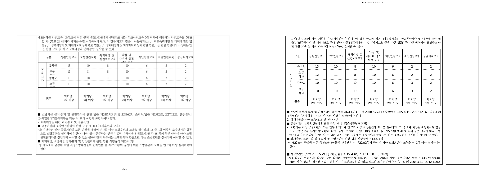
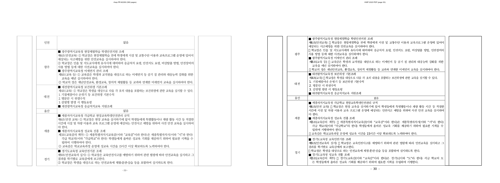

# PR #2290 검토 - #2287 표 밀집 문서 과소분할 보정

- 검토일: 2026-07-16
- 대상: [PR #2290](https://github.com/edwardkim/rhwp/pull/2290), [Issue #2287](https://github.com/edwardkim/rhwp/issues/2287)
- 작성자: `planet6897`
- 최종 검토 head: `96a3ebdda92efc38196ca03ac5b3be74a9c5a87e`
- 규모: 11 files, +812/-8, HWP 재현 샘플 1개 추가
- 리뷰어: `jangster77` 지정 완료

## PR 주장과 범위

PR은 다음 두 표 밀집 문서의 과소분할 결함을 보정한다.

1. RowBreak rowspan 블록 연속 조각에서 `start_cut` 뒤 잔여 높이가 0으로 평가되어 표 내용이
   증발하는 결함
2. 저장 `LINE_SEG`가 없는 TAC(글자처럼) 그림/도형 anchor 문단의 흐름 높이가 0으로 붕괴하는 결함

관련 잔여는 [#2237](https://github.com/edwardkim/rhwp/issues/2237),
[#2279](https://github.com/edwardkim/rhwp/issues/2279), [#2287](https://github.com/edwardkim/rhwp/issues/2287)로
분리해 추적한다. 이 PR은 [#2287](https://github.com/edwardkim/rhwp/issues/2287)을 자동 close하지 않는다.

## 기준 자료와 시각 검증

- 원본: `samples/task2287/1342000_edu_curriculum_map.hwp`
  - SHA-256: `623b00d56beffc45d27c5bf23911bdc49d3a541ded8aecbb323d0716a2bc9f4e`
- 기준 PDF: HWP 2020 MCP print 결과 415쪽.
  - 검토 범위 p25-35 분리본:
    [`pdf/task2287/1342000_edu_curriculum_map-2020-p025-p035.pdf`](../../../pdf/task2287/1342000_edu_curriculum_map-2020-p025-p035.pdf)
  - 11쪽, 4,571,674 bytes, SHA-256
    `5f108f123b3ff4c1e5c6ca76072538a23e676e927a9b14fad799962de8c4cf7d`
- 최종 head native SVG export: 380쪽. 기준 PDF와 문서 전체 쪽수는 아직 35쪽 차이가 나므로
  [#2287](https://github.com/edwardkim/rhwp/issues/2287)은 open으로 유지한다.

최초 검토 때의 p26 공백화와 p30 frame-tail overflow는 보완 전 head의 증적이다.
[`p26 보완 전 증적`](../assets/pr_2290/task2287_p026_review.png),
[`p30 보완 전 증적`](../assets/pr_2290/task2287_p030_review.png),
[`보완 전 visual sweep 요약`](../assets/pr_2290/task2287_visual_sweep_summary.json)은 그 상태를 보존한다.
현재 merge 판단에는 사용하지 않는다.

최종 head를 HWP 2020 PDF p25-35와 같은 페이지 번호로 다시 대조했다. 좌측은 rhwp native SVG,
우측은 HWP 2020 PDF raster다.

- p26: 이전의 sliver/공백화 대신 학생 안전교육 표와 본문이 page frame 안에 남는다.
- p30: 이전에 frame 아래 약 2,032px까지 이어지던 대형 tail overflow가 없다.
- 글꼴과 줄바꿈의 세부 차이는 남지만, 이번 PR의 판단 범위인 rowspan 조각 연속성 및 frame 밖 렌더는
  해소됐다.

## 검증

- `git diff --check`: 통과
- `cargo fmt --check`: 통과
- focused regression:
  `CARGO_INCREMENTAL=0 cargo test --profile release-test --test issue_2287_edu_rowspan_block_fragments --test issue_2070_rowbreak_density`
  - 4/4 통과
- 전체 회귀: `CARGO_INCREMENTAL=0 cargo test --profile release-test --tests` 통과
- `CARGO_INCREMENTAL=0 cargo clippy --all-targets -- -D warnings`: 통과
- `wasm-pack build --target web --out-dir pkg`: 통과
- 검토 시점 GitHub Actions: `Build & Test`, `Native Skia tests`, `CodeQL`, `Canvas visual diff`를 포함한
  required check 성공. `WASM Build`와 `Frontend package gates`는 변경 경로 조건으로 skipped다.

## Findings

### P1 해소 - rowspan 조각 소비와 렌더 bbox가 같은 컷 의미론을 사용한다

`typeset.rs`는 오프셋 컷의 페이지 소비를 `consumed_height`로 통일해 첫 조각의 과대 소비와
연속 조각의 0 소비를 함께 막는다. `table_partial.rs`는 컷 블록 행을 콘텐츠 높이로 계산하고,
rowspan 가시 높이를 블록 합에 반영해 renderer bbox가 typeset 소비와 어긋나지 않게 한다.

새 통합 회귀 `tests/issue_2287_edu_rowspan_block_fragments.rs`는 동봉 HWP의 p25-p31에 대해
각 조각의 최소 text run 수, page frame 안의 `ymax`, p26의 학생 안전교육 본문을 직접 고정한다.
따라서 최초 검토에서 지적한 "p26의 내용이 p30으로 이동" 회귀를 페이지 수만이 아니라 render tree로
차단한다.

### P2 - 최종 쪽수 기록이 보완 전 수치다

PR 본문과 `mydocs/report/task_m100_2287_report.md`는 범교과 연결 맵 결과를 `381 / 415, 잔여 -34`로
기록한다. 그러나 최종 head에서 sliver 페이지가 제거된 뒤 native export는 `380 / 415, 잔여 -35`다.
코드, 테스트, 기준 PDF, 시각 판정에는 영향을 주지 않는 문서 정합성 문제다.

## 최종 권고

**Accept / merge 가능.** 최초 P1은 최종 head의 코드, 동봉 HWP 통합 회귀, p26/p30 재시각 검증으로
해소됐다. [#2287](https://github.com/edwardkim/rhwp/issues/2287)은 전체 페이지 차이와 TAC 대형 corpus의
잔여 축을 계속 추적한다.

P2 수치는 merge 보류 사유가 아니다. 원 코드 PR을 merge한 뒤 별도 docs-only 후속 PR에서
`mydocs/report/task_m100_2287_report.md`와 필요한 PR 설명의 `381 / -34`를 `380 / -35`로 정정하도록
요청한다. 후속 PR은 코드, 테스트, 샘플, golden을 변경하지 않으며, 현재 최종 head와 위 검증 결과를
근거로 기록만 정합시킨다.
